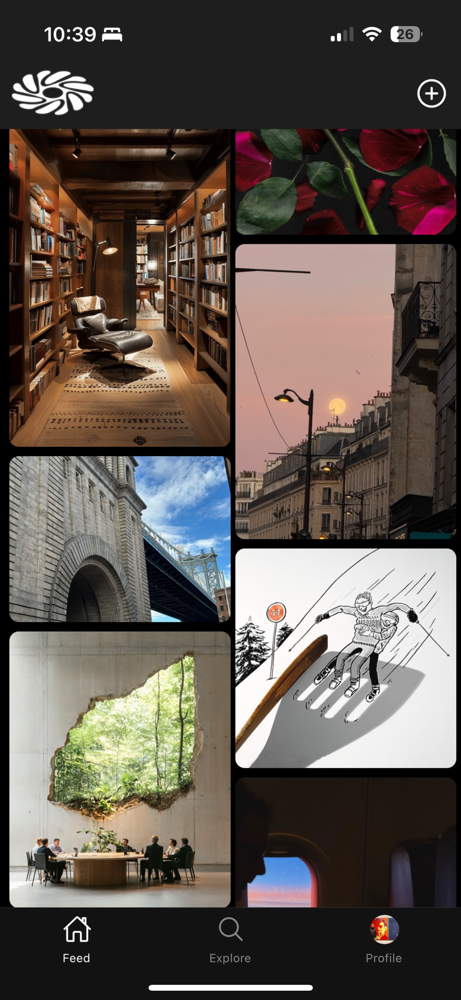
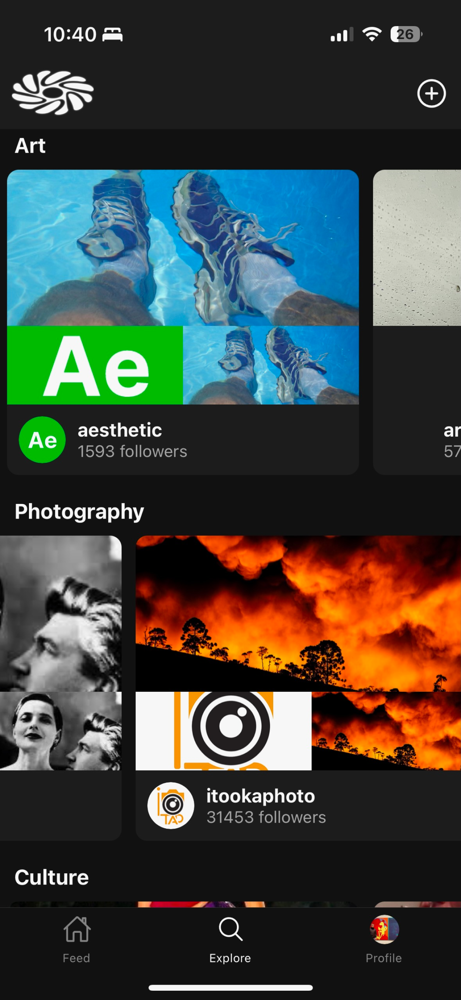

## The Rhizome Mobile Client

Expo mobile app for [The Rhizome](https://the-rhizome.com/) by [@GRITCULT](https://x.com/GRITCULT). Read full back story [here](https://paragraph.xyz/@sean07.eth/the-rhizome).

### Production Deployments

[Android](https://play.google.com/store/apps/details?id=com.theRhizome)

[iOS](https://testflight.apple.com/join/e4gXKFn7) _TestFlight only, Apple was being a diva in the review process._

### About

The Rhizome is the aesthetic first [Farcaster](https://www.farcaster.xyz/) client inspired by pinterest/tumblr/arena. Browse and post aesthetic inspiration. Built for discovery & curation of media. Mission: Make the internet aesthetic again. Beauty matters.

<table>
  <tr>
    <td></td>
    <td></td>
  </tr>
</table>

### Ideas

Some feature ideas:

- Add a crypto wallet and make Farcaster frames work.
- ~~Make use of the [Zora](./src/components/screens/ZoraDetail.js) integration, pull in content from Zora into a separate tab.~~ Make the Zora content mintable with a crypto wallet.
- Pull in content from other sources like [are.na](https://dev.are.na/documentation/channels).

### Requirements

- [Node.js](https://nodejs.org/) (version 20 or higher)
- [npm](https://www.npmjs.com/)
- [Expo CLI](https://docs.expo.dev/get-started/installation/)

### Installation

1. Clone repo

```bash
git clone https://github.com/Simple-Cohort-LLC/the-rhizome.git
cd the-rhizome
```

2. Install dependencies

```bash
npm install
```

3. Run the app

```bash
npx expo start -c
```

4. Scan QR code on iOS device or Android.

### Server

The app uses [Neynar](https://neynar.com/) and [Pinata](https://docs.pinata.cloud/api-reference/introduction) to integrate with Farcaster. There is an example server [here](https://github.com/Simple-Cohort-LLC/example-server). Clone the server repo and follow instructions to set it up, run it locally or deploy to the cloud and add the URL to your `.env` file.
